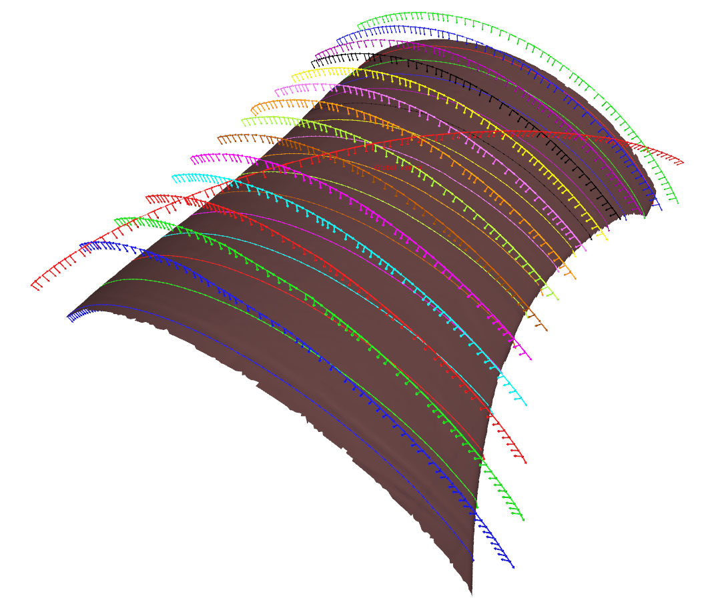

 [](http://www.institutmaupertuis.fr) Bezier
===

[](https://travis-ci.org/ros-industrial-consortium/bezier)

# Overview
This repository is part of the [ROS-Industrial](http://wiki.ros.org/Industrial) program.

This project has been developed by the [Institut Maupertuis](http://www.institutmaupertuis.fr), a French research institute that is working on robotic industrial processes.
This project goal is to create an automatic grinding path generator for 6-axis robots working on diverse/random meshes.

Bezier planner generates robot poses (3D trajectories) in harmony with a grinding process, it is as 6D tool path planner.
It is able to create rectilinear trajectories on complex surfaces (3D surfaces) and to dilate them in all directions in order to grind defects with a pass principle.



[](https://www.youtube.com/watch?v=aLp8zxx1PnU)
Click the image to see a video of a Fanuc robot grinding thanks to the Bezier library.

# Dependencies
This package has been tested with Ubuntu 18.04 and ROS Melodic.

## VTK
VTK 7.1 or higher is required in order to compile this project.

Here are quick steps to download, compile and install VTK latest release:

```bash
sudo apt install -y cmake libglew-dev libxt-dev libqt5x11extras5-dev qttools5-dev
mkdir -p $HOME/libraries/VTK-8.2.0/build_release
cd $HOME/libraries/VTK-8.2.0
wget http://www.vtk.org/files/release/8.2/VTK-8.2.0.zip
unzip VTK-8.2.0.zip
mv VTK-8.2.0 src
cd build_release
cmake ../src \
-DCMAKE_BUILD_TYPE=Release \
-DVTK_Group_Imaging=ON \
-DVTK_Group_Qt=ON \
-DVTK_QT_VERSION=5 \
-DVTK_Group_Rendering=ON \
-DVTK_Group_Views=ON
make -j4
```

Install with:
```bash
sudo make -j4 install
sudo ldconfig
```

## rosdep
Install, initialize and update [rosdep](http://wiki.ros.org/rosdep).

# Compiling
Create a catkin workspace and clone the project:

```bash
mkdir -p catkin_workspace/src
cd catkin_workspace/src
git clone https://github.com/ros-industrial-consortium/bezier.git
cd ..

```

## Resolve ROS dependencies
```bash
rosdep install --from-paths src --ignore-src --rosdistro melodic -y
```

## Compile
Use `catkin_make` or `catkin tools`:

```bash
catkin_make
catkin build
```

# Documentation
## API documentation

Install rosdoc_lite:
```
sudo apt install ros-$ROS_DISTRO-rosdoc-lite
```

Generate the API documentation:
```bash
catkin_make bezier_doc
```

## Documented classes of Bezier
- [bezier_grinding_surfacing](README_bezier_grinding_surfacing.md)

# Example packages using `bezier`
- [bezier_examples](https://github.com/ros-industrial-consortium/bezier_examples)
- [fanuc_grinding](https://gitlab.com/InstitutMaupertuis/fanuc_grinding)
