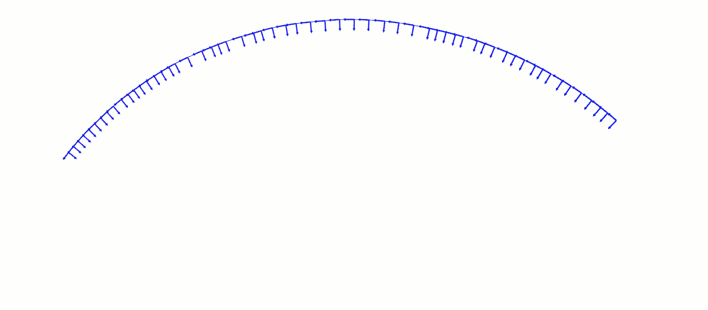

  filterExtricationTrajectory
===

The purpose of this function is to remove poses located on each extremum of an extrication trajectory.
The extrication filter compare the angle between a point of the grinding line and all the extrication points 
located in the side where the grinding point is placed.
The filter works in two parts :
 - The first part use as a reference point the last point of the grinding line N. It compute the angle between
   the normal of this point and the vector between the reference point and the extrication point.
   as long as the value of the angle is outside the bounds defined by upper_tolerance and lower_tolerance,
   the extrication point is filtered. When the angle fall inside the bounds, the process for this side is stopped.
 - The same process is repeated on the other side of the extrication line, using as reference point, the first point
   of the grinding line N + 1

At the end of theses process, all the point which haven't been filtered are removed from the trajectory vector.

The following animation show the result when the fitler is applied : 

